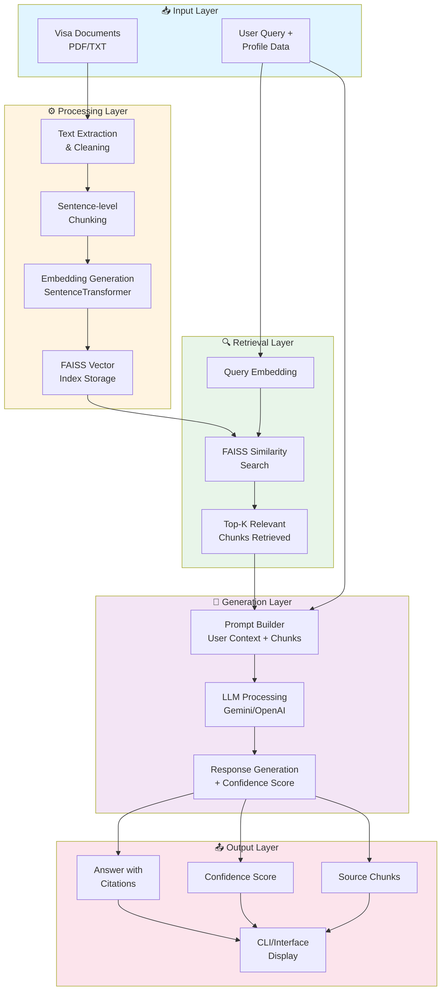

# SwiftVisa — AI-Powered Visa Eligibility Assistant

SwiftVisa is an AI-driven application that leverages **Retrieval-Augmented Generation (RAG)** and Large Language Models (LLMs) to provide intelligent, document-grounded visa eligibility assistance for multiple countries, including **Canada, USA, UK, Schengen, and Ireland**.

This project combines **Natural Language Processing (NLP)**, **vector embeddings**, **FAISS similarity search**, and **state-of-the-art LLMs** to provide users with accurate answers based on legal visa documents.

---

## 📝 Project Overview

SwiftVisa allows users to:

- Ask **visa-related questions** like eligibility, requirements, or criteria
- Receive **document-backed responses** with citations from relevant legal documents
- View a **confidence score** indicating how reliable the answer is
- Inspect the **relevant source chunks** used to form the response

The system currently supports multiple countries' visa policies and can be extended to other countries or visa types.

---

## 🏗️ System Architecture



---

## 📂 Project Structure

```
SwiftVisa/
│
└── Richa_Mishra/
    │
    └── complete_project/
        │
        ├── Data/                      # PDF/TXT visa documents, embeddings, metadata
        │
        ├── utils/                     # MILESTONE  - 01    -------   Utility scripts for NLP, chunking, embeddings
        │   ├── nltk_setup.py
        │   ├── pdf_utils.py           # extract text from documents and perform necessary preprocessing
        │   ├── chunking.py            # chunk text into smaller pieces
        │   ├── embedding.py           # create embeddings of 384 dimensions
        │   └── vector_store.py        # store embeddings in FAISS vector store 
        │
        ├── rag/                       # Core RAG system
        │   ├── llm_client.py          # LLM wrappers for Gemini/OpenAI
        │   ├── logger.py              # Logs queries, retrieval, and answers
        │   ├── pipeline.py            # Main RAG pipeline
        │   ├── prompt_builder.py      # Builds prompts for LLM
        │   └── retriever.py           # FAISS-based retrieval
        │
        ├── Test_Debug/                # Testing and debugging files
        │   ├── analyze_embeddings.py
        │   ├── debug.py 
        │   ├── llm_api.py
        │   ├── llm_local.py 
        │   ├── query.py
        │   ├── rag_gemini.py 
        │   └── retrieval.py
        │
        ├── main.py                    # Processes documents, chunks, embeds, builds index
        ├── query_cli.py               # Command-line interface for asking visa questions
        ├── requirements.txt           # Python dependencies
        ├── streamlit_app.py           # frontend for the bot
        ├── user_queries.json          
        ├── query_results.json
        ├── process_test_queries.py    # processes queries from user_queries.json and give output in JSON format and store in query_results.json
        └── README.md                  # This file
```

---

## ⚙️ Features

### 1. **Document Processing & Embeddings**
- Extracts text from PDFs/TXT files
- Performs sentence-level chunking
- Generates embeddings using **Sentence-Transformers**
- Stores vectors in **FAISS index** for similarity search

### 2. **RAG + LLM Query System**
- Uses retrieved chunks to generate **document-grounded responses**
- Supports both **Gemini API** and **OpenAI API** for language generation
- Handles **input/output safety**, fallback prompts, and robust JSON extraction

### 3. **Confidence Scoring**
- Combines **retrieval relevance** and **LLM reasoning**
- Provides a final blended confidence score for each answer

### 4. **User Interaction**
- CLI interface
- Streamlit Dashboard for enhanced user experience
- Provides **conversational responses**, relevant document chunks, and reasoning

---

## 🔄 How It Works

### Document Processing Pipeline
1. **Text Extraction**: PDF/TXT documents are processed and cleaned
2. **Chunking**: Text is split into sentence-level chunks for granular retrieval
3. **Embedding**: Each chunk is converted to a vector using SentenceTransformer
4. **Indexing**: Vectors are stored in a FAISS index for efficient similarity search

### Query Processing Pipeline
1. **User Input**: User provides profile data and asks a visa-related question
2. **Query Embedding**: Question is converted to a vector representation
3. **Retrieval**: FAISS finds the most similar document chunks
4. **Prompt Construction**: Retrieved chunks + user context are formatted for LLM
5. **Generation**: LLM generates an answer with confidence score and citations
6. **Output**: Answer is presented with source references and confidence metrics

---

## 🛠️ Installation & Usage

### Prerequisites
- Python 3.10 or higher
- Conda (recommended) or virtualenv
- API keys for Gemini and/or OpenAI
- Git installed on your system

### Setup

1. **Clone the repository:**
```bash
git clone https://github.com/springboardmentor96762t-ship-it/Swift_visa.git
cd Swift_visa
```

2. **Create and activate Python environment:**
```bash
conda create -n infosys python=3.10 -y
conda activate infosys
```

3. **Install dependencies:**
```bash
pip install -r requirements.txt
```

4. **Configure API keys:**
Create a `.env` file in the project root and add:
```
GEMINI_API_KEY=your_gemini_api_key_here
OPENAI_API_KEY=your_openai_api_key_here
```

5. **Place your visa documents:**
Add your visa PDFs/TXT files to `Data/pdfs/`

6. **Build embeddings and FAISS index:**
```bash
python main.py
```

7. **Start the CLI chatbot:**
```bash
python query_cli.py
```
**OR**

7. **Start the Streamlit Dashboard:**
```bash
python streamlit_app.py
```

8. **Interact with the system:**
- Enter your profile details (age, nationality, income, etc.)
- Ask visa-related questions
- View answers with confidence scores and source citations

---


## 📂 Deliverables

- ✅ Processed visa documents (JSON chunks + FAISS index)
- ✅ Python scripts for document processing, embeddings, retrieval, and RAG
- ✅ CLI chatbot + Sreamlit Dasboard to query visa eligibility
- ✅ Logs of queries, retrieved chunks, and final answers
- ✅ Confidence scoring and citations for each response

---

## 🎯 Key Learnings

- Implementing **RAG (Retrieval-Augmented Generation)** for domain-specific question answering
- Using **FAISS** for efficient similarity search with embeddings
- Integrating **LLM APIs** (Gemini/OpenAI) safely in a production-ready pipeline
- Handling document chunking, normalization, and indexing
- Combining retrieval confidence with LLM reasoning to produce robust answers
- Designing CLI interfaces for structured user interaction

---

## 📌 Notes

- Ensure your `.env` file contains valid `GEMINI_API_KEY` and/or `OPENAI_API_KEY`
- FAISS index and embeddings must be rebuilt if documents are updated
- The system currently supports visa eligibility queries for Canada, USA, UK, Schengen, and Ireland
- Future improvements can include a web interface, more countries, and real-time document updates

---

## 🚀 Future Enhancements

- [ ] Support for additional countries and visa types
- [ ] Multi-language support
- [ ] Real-time document updates and incremental indexing
- [ ] Advanced filtering by visa category
- [ ] Export conversation history and recommendations

---

## 📄 References

- [FAISS Documentation](https://github.com/facebookresearch/faiss)
- [Sentence-Transformers](https://www.sbert.net/)
- [OpenAI API](https://platform.openai.com/docs)
- [Google Gemini API](https://ai.google.dev/)
- [U.S. Visa Information](https://travel.state.gov/content/travel/en/us-visas.html)
- [Canada Immigration](https://www.canada.ca/en/immigration-refugees-citizenship.html)

---

## ⚡ License

This project is for educational purposes. Please ensure compliance with relevant visa document usage rights and API terms of service.

---

## 👤 Author

**Internship Project**  
Repository: [Swift_visa](https://github.com/springboardmentor96762t-ship-it/Swift_visa)  
Organization: Infosys Springboard

Developed as part of an AI/ML internship focused on building production-ready RAG systems.

For questions or contributions, please open an issue or submit a pull request.

---

## 🙏 Acknowledgments

Thanks to our mentor Siddarth Sir. Special thanks to the open-source community for the amazing tools and libraries that made this project possible.